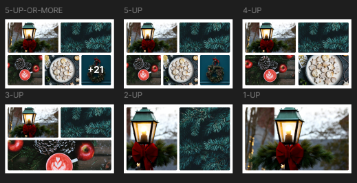

# Challenge #1

Welcome! This is Day 1 of the Advent of CSS! WOO HOO!

For today’s challenge, we’ll build a photo gallery card, similar to Facebook:

### Brief

Create a photo gallery card, similar to what Facebook uses in their feed. The “trick” here is not just to display the grid, but make the code “smart” enough to display the photos correctly, regardless of whether there’s 1 photo or 21.

#### Getting Started

1. Take a look around. Look at the project’s Figma file to see exactly what we’ll be building. If you don’t have a Figma account, don’t worry, you can set one up for free.

2. You’re more than welcome to use any framework you’d like.

3. Happy coding!

4. Once you’re finished, share your work using #adventofcss

#### FAQs

- Can I use libraries / frameworks like TailwindCSS on these projects? Of course! This is also a good opportunity to challenge yourself and experiment with something new.

- Oh no! I’m stuck! Comment on this challenge, here, within Podia. As a community, let’s help each other out.

- Can I use this project in my portfolio? Sure! But, be honest about the work that you did.

Merry Coding,
Amy